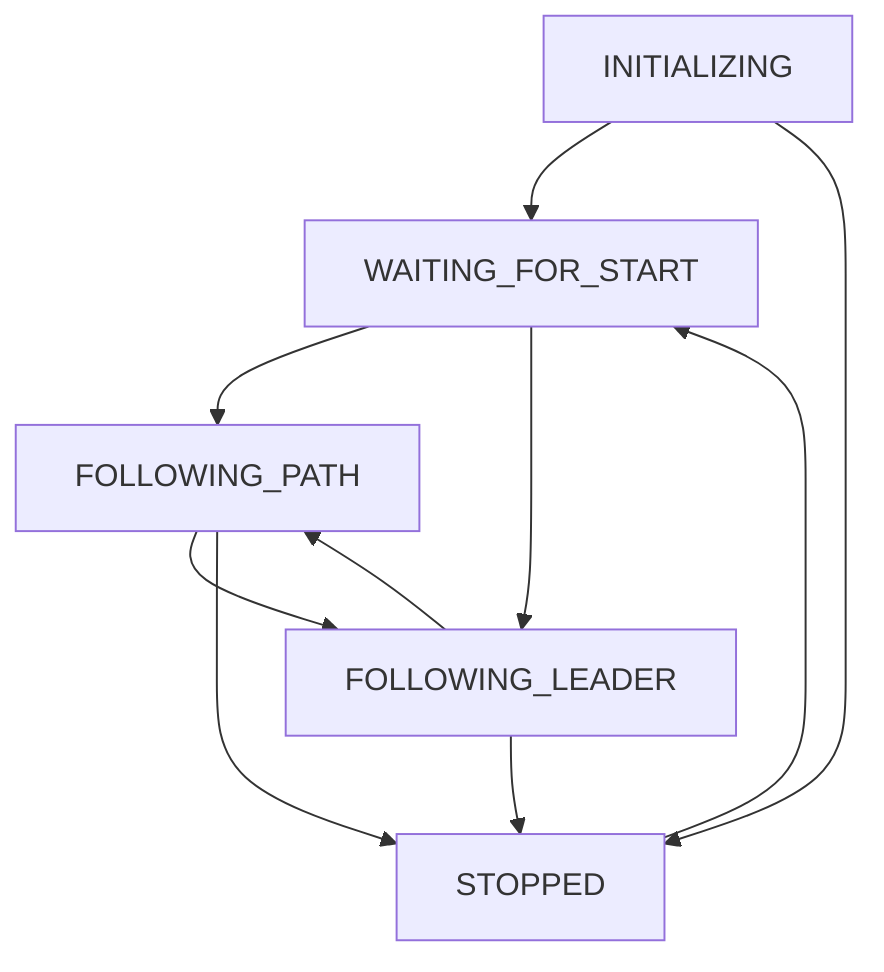

# Vehicle State Machine

## Overview
A simplified state machine architecture for autonomous vehicle control that reduces complexity by using essential vehicle states with internal transition logic.

## File Structure
```
StateMachine/
├── __init__.py
├── README.md
├── vehicle_state.py           # State enumerations
├── state_handler.py          # Base state handler class
├── vehicle_state_machine.py  # Main state machine controller
├── initializing_state.py     # System initialization
├── waiting_for_start_state.py # Ready/idle state
├── following_path_state.py   # Autonomous path following
├── following_leader_state.py # Leader following (platoon mode)
└── stopped_state.py          # Emergency/manual stop
```

## Key Features
- **Internal Transition Logic**: Each state manages its own transitions
- **No Centralized Validation**: States decide valid next states independently
- **Simplified Architecture**: Only essential vehicle states included

## State Definitions

| State | Purpose | Entry Condition | Key Responsibilities |
|-------|---------|----------------|---------------------|
| **INITIALIZING** | System startup | System boot | Hardware checks, sensor validation, controller setup |
| **WAITING_FOR_START** | Ready/idle | Initialization complete | Monitor for start commands, maintain zero motion |
| **FOLLOWING_PATH** | Autonomous navigation | Start command | Waypoint following, speed/steering control, lap tracking |
| **FOLLOWING_LEADER** | Platoon mode | Leader detected | Maintain following distance, formation tracking |
| **STOPPED** | Safety/manual stop | Stop command/emergency | Ensure zero motion, monitor resume conditions |

### State Transitions



### Transition Conditions
- **→ WAITING_FOR_START**: System initialization complete
- **→ FOLLOWING_PATH**: Start command received, no leader detected
- **→ FOLLOWING_LEADER**: Leader detected and platoon enabled
- **→ STOPPED**: Stop command, emergency condition, or safety trigger

## Implementation

### State Handler Interface
All states inherit from `StateHandler` with these methods:

```python
class StateHandler:
    def enter(self) -> bool:
        """Called when entering state. Returns success status."""
        
    def update(self, dt, sensor_data) -> Tuple[float, float, Optional[Tuple]]:
        """
        Called every control loop.
        Returns: (throttle, steering, transition_info)
        transition_info: (next_state, reason) or None
        """
        
    def exit(self):
        """Called when exiting state."""
```

### Sensor Data Structure
```python
sensor_data = {
    'x': float,           # Position X (m)
    'y': float,           # Position Y (m) 
    'theta': float,       # Heading (rad)
    'velocity': float,    # Speed (m/s)
    'motor_tach': float,  # Motor encoder reading
    'gyro_z': float,      # Gyroscope Z-axis
    'state_valid': bool,  # EKF state validity
    'yolo_data': {        # Perception data
        'cars': bool,
        'car_dist': float,
        'stop_sign': bool,
        # Additional detection flags
    }
}
```

### Control Loop Flow
```
1. Read sensors → 2. Update EKF → 3. Prepare sensor data → 
4. state_machine.update() → 5. Send motor commands
```

## Usage Example

```python
from vehicle_state_machine import VehicleStateMachine

# Initialize state machine
state_machine = VehicleStateMachine()

